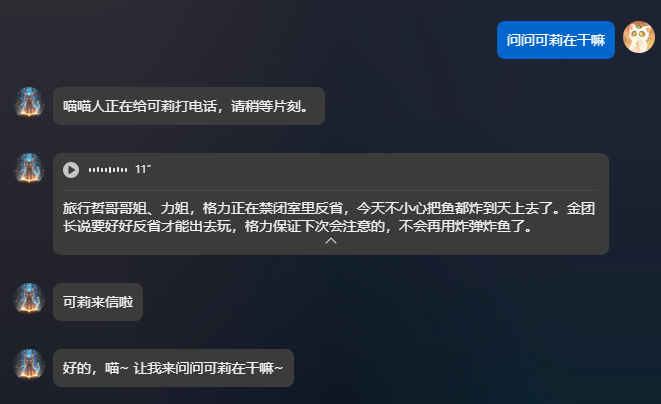

# AstrBot Plugin Miaomiao
# 喵喵的插件

这是一个为 AstrBot 开发的插件，仍然在开发中，提供了一些有趣的功能，如随机推荐食物、扔骰子、生成语音等。

## 安装

通过插件管理安装本仓库链接： 
https://github.com/miaoxutao123/astrbot_plugin_miaomiao

## 依赖库

**已经设置好了requirements.txt文件，python依赖库安装插件时会自动安装**

**确保安装了 `ffmpeg`，并且在系统路径中可用。**

## 功能

### 喵喵喵
发送 `/喵` 指令，机器人会回复 `喵喵喵, {user_name}!`。

### 今天吃什么呀
发送 `/今天吃什么呀` 指令，机器人会随机推荐一种食物。

### 扔个骰子
发送 `/扔个骰子` 指令，机器人会随机生成一个 1 到 6 的数字。

### gpt-sovits
插件核心功能之一，使用gradio调用部署在huggingface space上的tts服务实现大模型自主调用指定角色的 TTS 语音功能，生成语音消息。（效果一般般，正在考虑重构，需要方法的可以提issues）效果是这样的：

### pic-gen
插件核心功能之一，使用硅基流动的api生成图片，使用llm调用（没注册的可以用我的邀请连接谢谢喵https://cloud.siliconflow.cn/i/lYQ2rcwq）

### music_search(不稳定，正在尝试解决)
插件核心功能之一，使用API搜索歌曲信息。已注册llm组件，可以直接使用自然语言点歌（fork from https://github.com/Hazellol/astrbot_plugin_music-search/blob/master/crawler.py）

### office_tool（仍在开发中）
插件核心功能之一，处理Word和Excel文档。发送 `/office_tool {文档类型} {操作类型} {文件路径} {标题} {副标题} {内容}` 指令，机器人会创建或修改指定的Word或Excel文档。

### 喜报生成器
发送 `/喜报 {消息}` 指令，生成一张带有指定消息的喜报图片。(copy by https://github.com/Soulter/astrbot_plugin_essential)

### duck_duck_go（仍在开发中）
插件核心功能之一，使用DuckDuckGo API搜索信息。用于补充默认web_search插件。
